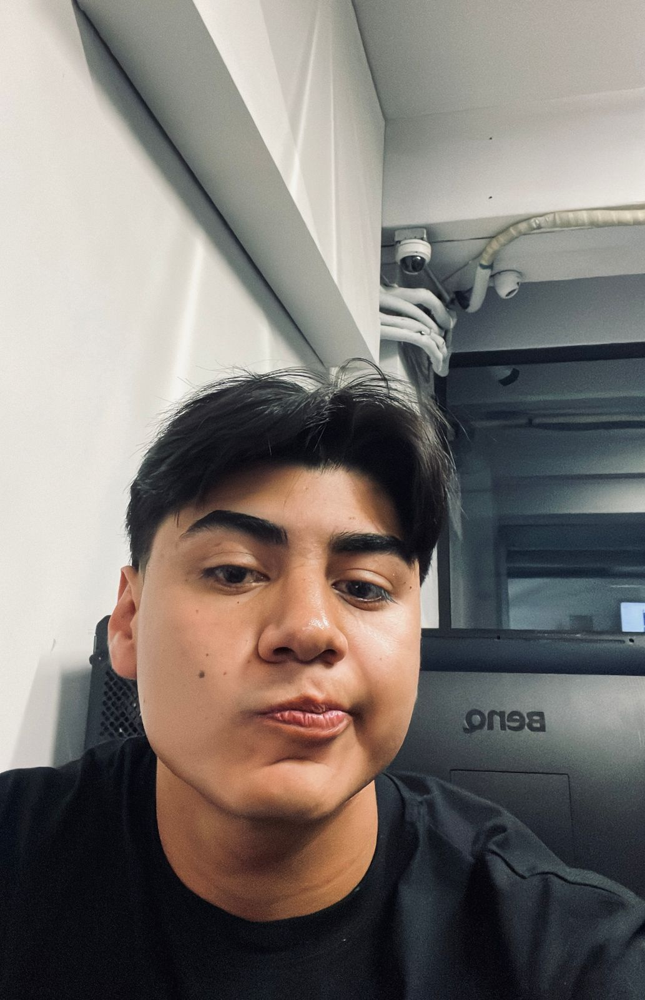

# 
 Hola, mi nombre es Misael Bautista 

### 
 Estudiante de tercer semestre de la Ing. En desarrollo de Software Interactivo y Videojuegos, con experiencia principalmente en el desarrollo de videojuegos con enfoque a Unity por ahora, por lo que principalmente manejo c# mas sin embargo estoy en proceso aun de aprender nuevos lenguajes y estoy abierto a no solo programar videojuegos.

</img>

- Actualemente aprendiendo a trabajar con **git**.

- Experiencia con **C#** principalmente para Unity, pero **C++** y **JS** están en proceso.

- Manejo principalmente **Unity** pero recientemente estoy aprendiendo **Unreal Engine**

- Participe en la **Global Game Jam del 2025**

- Por ahora solo tengo dos jugos publicados en mi pagina de [itch.io](https://boxy-dev.itch.io/).
  - Mi primer videojuego [**The Awakening: Lost Innosences**](https://mokarun.itch.io/the-awakening-lost-innosences).
  - EL juego de la GGJ 2025 titulado [**Foraneo simulator**](https://xtianlors.itch.io/foraneo-simulator).

- Dato curioso, soy amante de los videojuegos, del gymnasio y de One piece.

#### Contactame:
 - [Instagram](https://www.instagram.com/evo_dev/)
 - misalmon3454@gmail.com
 

